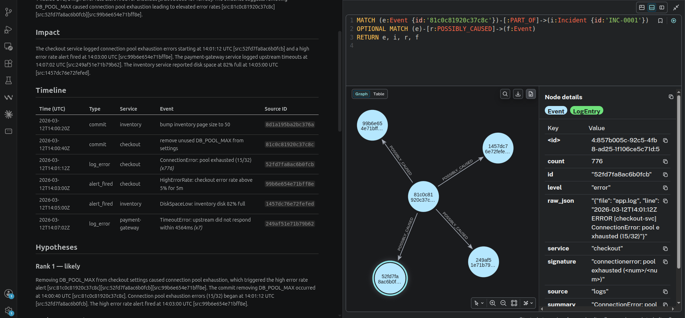

# Postmortem Autopilot

**Evidence-grounded incident postmortems.** A pipeline that reconstructs an
incident timeline from logs, alerts, deploys and commits, then writes a
postmortem in which *every factual claim is mechanically traceable to a
timestamped source event* — or it doesn't ship.

The differentiator is not "an LLM writes a postmortem." It's that the system
**cannot** state a fact it can't cite, because citation validity is checked by
deterministic code against a graph, not by a prompt.

---

## The 60-second version

```
incident window ──► collect evidence ──► temporal knowledge graph
                                              │
                          deterministic candidate causal links
                                              │
                             LLM ranks competing hypotheses
                                              │
                              LLM writes the postmortem draft
                                              │
                     deterministic validator: every claim cited?
                       every cited node ID real? coverage ≥ 95%?
                                    │              │
                                  PASS           FAIL ──► retry with
                                    │                     validator feedback
                                    ▼
                        postmortem_INC-0007.md + graph
```

## Architecture: the three planes

The single most important structural decision: **the LLM is fenced into the
middle third of the pipeline.** Everything before it is deterministic
collection; everything after it is deterministic verification. It can select,
rank, and phrase facts — it cannot introduce one. (Full detail in
[docs/01-architecture.md](docs/01-architecture.md).)

```
┌──────────────────────────────────────────────────────────────────┐
│EVIDENCE PLANE — deterministic, no LLM, no tokens, fully testable │
│                                                                  │
│  Collectors ─► Normalizer ─► Graph Writer ─► Candidate Linker    │
│  (logs, alerts, git) → Event (schema + signature) → Neo4j MERGE  │
│  three cheap heuristics: temporal proximity, service overlap,    │
│  change-path overlap. Recall with code, never with an LLM.       │
└──────────────────────────────────────┬───────────────────────────┘
│           candidate hypotheses = sets of real node IDs           │
│                   nothing else reaches the LLM                   │
│                                ▼                                 │
┌──────────────────────────────────────────────────────────────────┐
│REASONING PLANE — LangGraph, exactly two model calls per run      │
│                                                                  │
│  Analyst ─────────────────► Writer                               │
│  ranks competing hypotheses, names disconfirming evidence        │
│  renders the postmortem; each factual sentence is cited          │
│                                                                  │
│  Constraint: may only reference node IDs handed to it.           │
└──────────────────────────────────────┬───────────────────────────┘
│                          draft markdown                          │
│                                ▼                                 │
┌──────────────────────────────────────────────────────────────────┐
│VERIFICATION PLANE — deterministic, no LLM                        │
│                                                                  │
│  Validator resolves every [src:...] tag against Neo4j:           │
│  ID real?  timestamp matches?  coverage >= 95%?  uncited claims? │
│                                                                  │
│  PASS ─► publish      FAIL ─► feedback ─► Writer (max 2x)        │
│  then ─► fail loudly                                             │
└──────────────────────────────────────────────────────────────────┘
```

A hallucinated citation is not a style problem, it's a correctness bug — and
it is caught by a `MATCH (n {id: $id}) RETURN n` query, not by a bigger model.
That is the whole project in one sentence.

## Status

**Phases 1–3 are complete.** Collectors → graph → candidate links → ranked
hypotheses → drafted postmortem → mechanical validation, with a bounded repair
loop — proven locally, in plain Docker, and as a real k3s Job. The 10-incident
golden corpus is green, the CI gates hold (hallucinated citations = 0), and
both images build and push from GitHub Actions on every merge to `main`.

Numbers below are the latest run from `evals/results/history.jsonl`
(regenerated by `python -m evals.update_readme`, never hand-edited):

<!-- EVAL-METRICS:START -->
Latest run (from `evals/results/history.jsonl`):

| Run | Model | Commit | Cases | P@1 | R@3 | COV | HALL | DECOY | ABST | Conf.sep | Cost |
|---|---|---|---|---|---|---|---|---|---|---|---|
| `2026-09-24 07:22 UTC` | mock | `0c40b3c` | 10 | 1.00 | 1.00 | 1.000 | 0.000 | 1.00 | 1.00 | n/a | n/a |

All hard gates passed: hallucinated citations = 0, coverage ≥ 0.95, precision@1 ≥ 0.70.
<!-- EVAL-METRICS:END -->

Hard gates are enforced in CI (docs/07): hallucinated citations must be
exactly zero, coverage ≥ 0.95, precision@1 ≥ 0.70. Metrics are logged per run
so the trend over time is plottable.

## What "traceable" actually means



Left: the generated postmortem. Right: the graph, queried live.

Follow one ID. `52fd7fa8ac6b0fcb` appears as a `[src:...]` tag in the Impact
paragraph, as a row in the code-rendered Timeline, and as a node whose stored
properties include the raw log line it came from — `count: 776`, because
signature collapsing folded 776 log lines into one failure mode.

Nothing in the left pane shipped without the right pane confirming it. The
validator resolves every tag against Neo4j and rejects the document if a single
one fails to resolve, if a cited timestamp disagrees with the node's, or if
coverage falls below 95%.

## Docs

| Doc | What's in it |
|---|---|
| [docs/00-overview.md](docs/00-overview.md) | Problem, scope, non-goals, why it's CV-worthy |
| [docs/01-architecture.md](docs/01-architecture.md) | The three planes, components, data flow, contracts |
| [docs/02-knowledge-graph.md](docs/02-knowledge-graph.md) | Neo4j schema, Cypher, the `memory.py` interface |
| [docs/03-confidence-model.md](docs/03-confidence-model.md) | How confidence is actually computed, and its limits |
| [docs/04-tech-stack.md](docs/04-tech-stack.md) | Every technology + why + honest scoping |
| [docs/05-k3s-deployment.md](docs/05-k3s-deployment.md) | k3s topology, Helm, resource budget, triggers |
| [docs/06-local-dev.md](docs/06-local-dev.md) | Docker Compose, env vars, running the demo incident |
| [docs/07-evaluation.md](docs/07-evaluation.md) | Golden incidents, metrics, CI gates |
| [docs/08-at-10x-scale.md](docs/08-at-10x-scale.md) | What breaks at 10× scale, and what I'd change first |
| [docs/09-cv-bullets.md](docs/09-cv-bullets.md) | CV bullets, all quantified from real eval numbers |
| [docs/adr/](docs/adr/) | Architecture decision records (the "why not X" answers) |
| [TODO.md](TODO.md) | Phased task list — the build order |

## Quickstart

```bash
python -m venv .venv && source .venv/bin/activate
pip install -r requirements-dev.txt

cp .env.example .env                 # add an API key, or set LLM_PROVIDER=mock
docker compose up -d                 # neo4j + valkey, ~20s to healthy
python -m agent.cli schema-init

# `repo/` is generated, not committed — a nested .git would become a gitlink
python evals/incidents/inc-0001-missing-env-var/build_repo.py

python -m agent.cli run --incident evals/incidents/inc-0001-missing-env-var/
# -> out/postmortem_INC-0001.md
# -> out/run_report_INC-0001.json
```

A run exits **non-zero if the document failed validation**, and writes the
rejected draft and the report anyway — you cannot see what was wrong with a
document you were not given.

```bash
python -m agent.cli validate --incident-id INC-0001 \
    --document out/postmortem_INC-0001.md

pytest tests/unit -q          # no containers, no API key
pytest tests/integration -q   # real Neo4j via testcontainers, mock provider
```

Then open the Neo4j browser at http://localhost:7474 and run the timeline query
from [docs/02](docs/02-knowledge-graph.md). **That side-by-side — the document
and the graph it was built from — is the demo.**

## Why k3s and not Kubernetes

Same API, ~10× less overhead, single binary, runs the whole stack on a 4 GB
VM. Everything written here is standard Kubernetes YAML — it would apply
unchanged to EKS/GKE. See [ADR-001](docs/adr/ADR-001-k3s-over-k8s.md).
